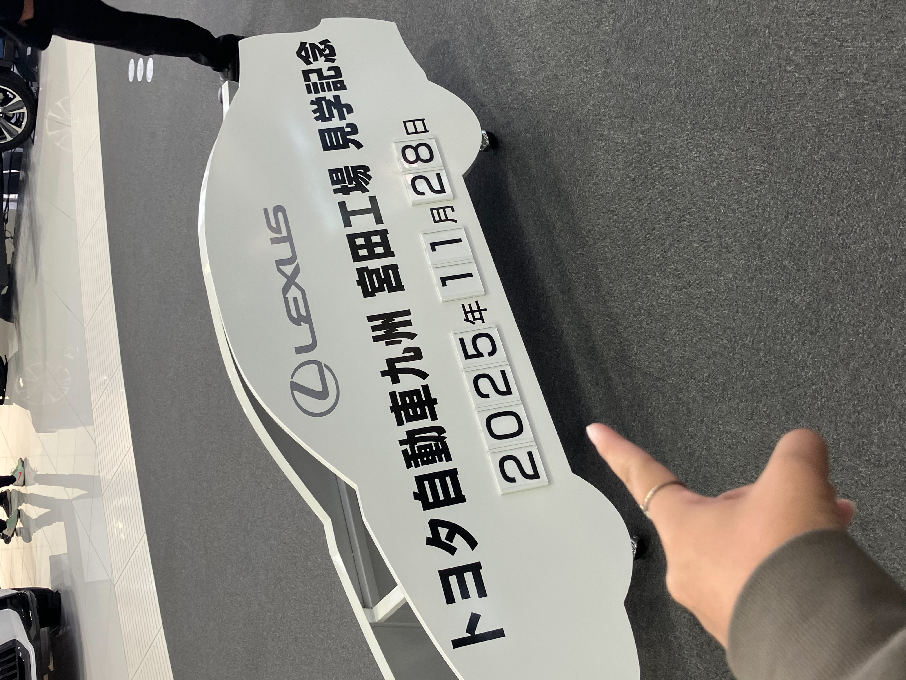
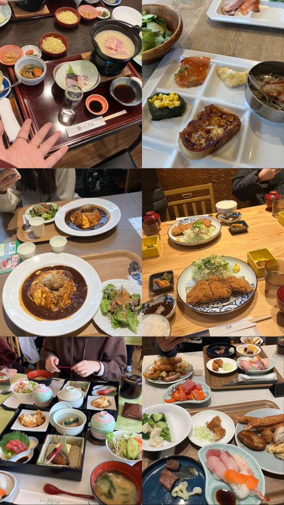
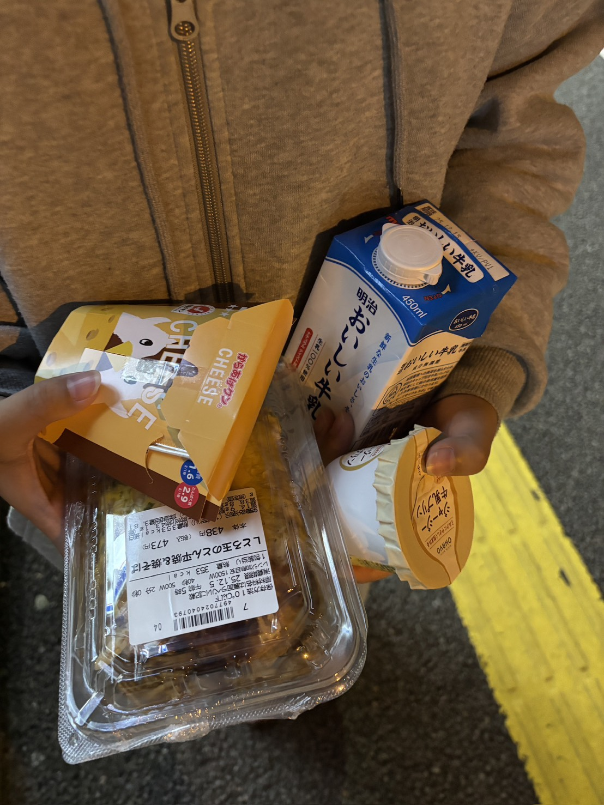
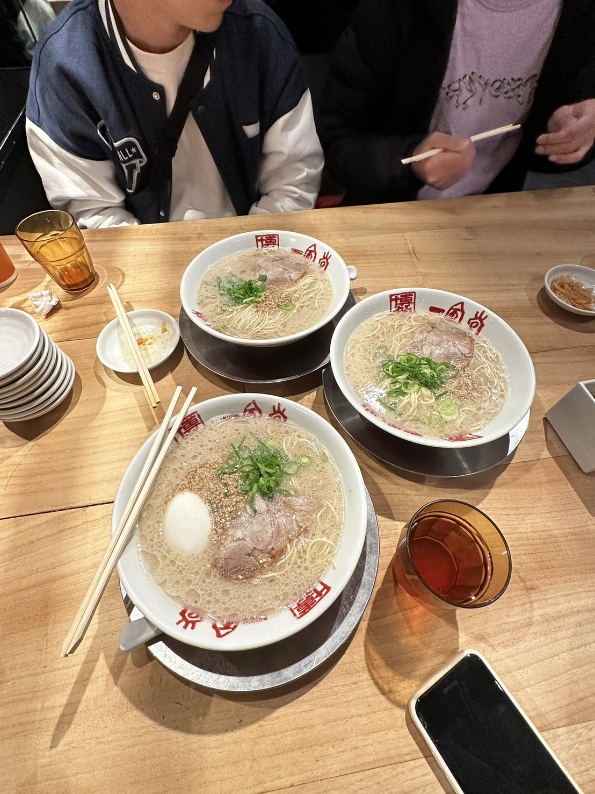

## 前言
在截止前一小時才交齊資料 + 計劃書有 AI 痕跡的我非常意外地過了面試，而且和其他台灣學生交流後才知道大家面試題目幾乎一模一樣，還發現有人備審資料格式全錯，甚至是親戚直接讓他走後門 ==

---
## 見學行程
這次見學主要有 2 間公司

### Lexus
我們只參觀了第一工廠（焊接 & 塗裝），因為高齡化和少子化，焊接和組裝的部分基本上都是交由機械手臂來操作，近距離觀看真的非常壯觀

### Trial
這我真的沒啥印象，有興趣左轉[維基百科](https://zh.wikipedia.org/zh-tw/TRIAL_COMPANY_(%E6%97%A5%E5%95%86))

---
## 觀光行程
14 天中有 9 天是觀光行程（包含上午上課下午觀光）
雖然行程不是教育部排的，但這聽起來不錯對吧！

非常值得一提的是，因為行程是校方安排的，經費又是花政府的
我們幾乎每餐都吃到飽，就算需要自理一餐也大約 500-600 台幣
這部分必須給到 MVP ✌️

---
## 我在日本幹嘛了
過超爽，每天都跟朋友出去夜遊，還會去買酒
(Lawson 的炸雞必須要大推一下的，起司口味超好吃)

體驗了很多日本文化，最難忘的必須是泡裸湯..
當然不免俗還是會想一下正在水深火熱準備段考的同學們 ^^

> 炒泡麵我覺得還好，但牛奶跟布丁也是頂的 👅

我覺得最可惜的是沒有吃到一蘭（　
第一間住的飯店附近就是一蘭總店，但我卻選擇去吃了一風堂
而且一蘭 8 點都會有表演，我一次都沒看到，超級難過欸

> 一風堂真的只適合嘗鮮..太油太膩了

---
## 推銷時間 ~
你在想什麼，右轉直走[官網](https://twpathfinder.org/)自己去看

